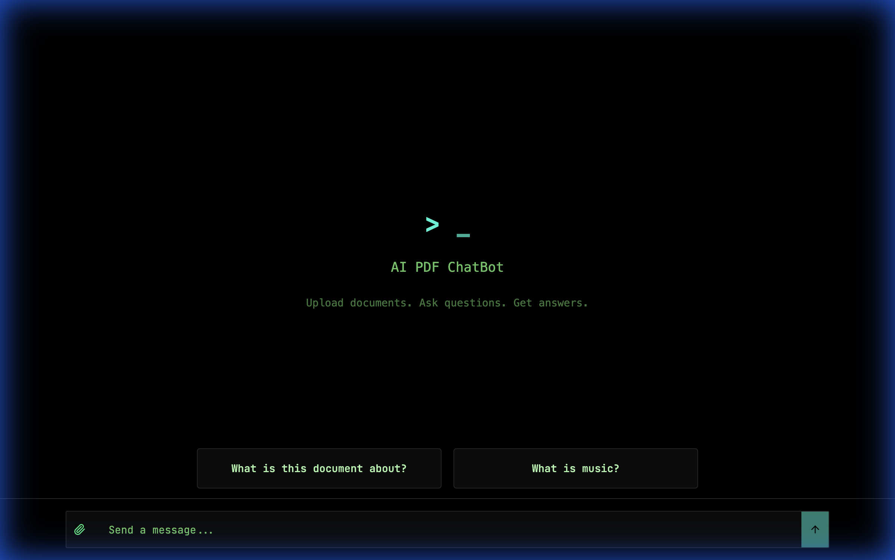
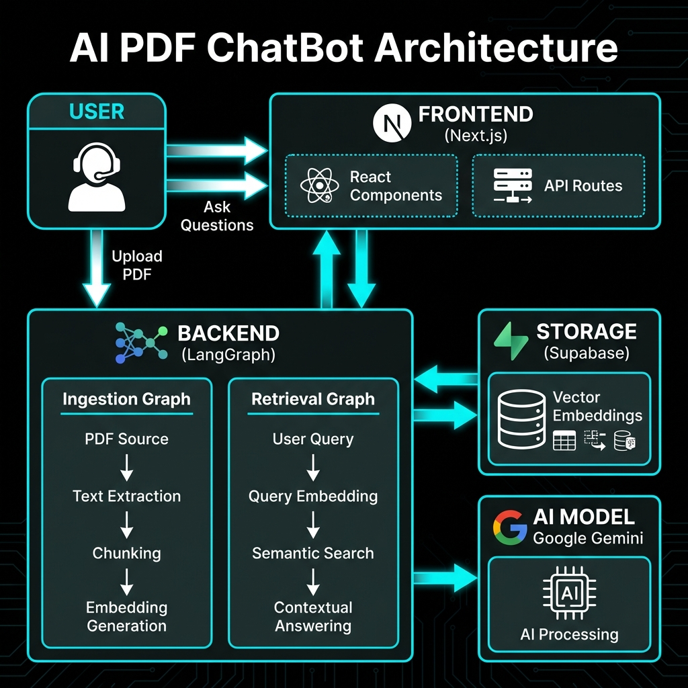
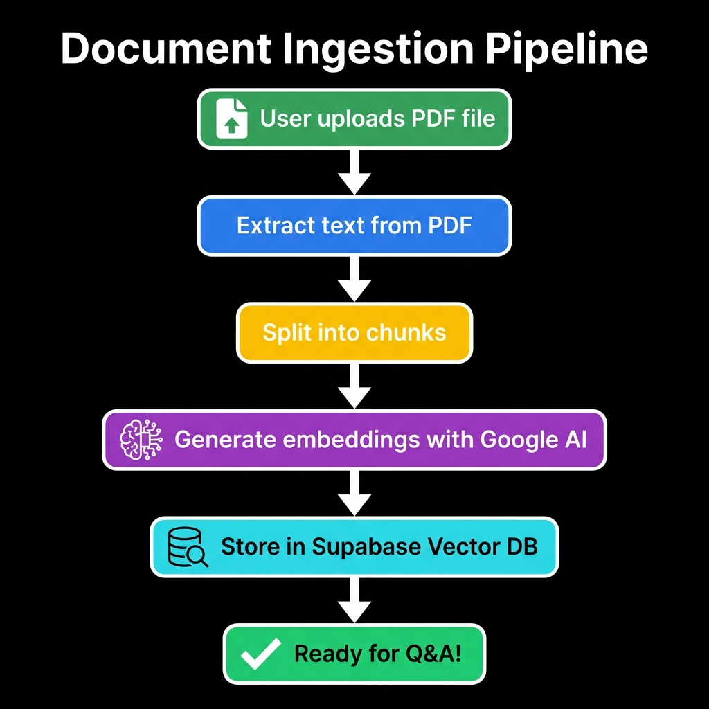
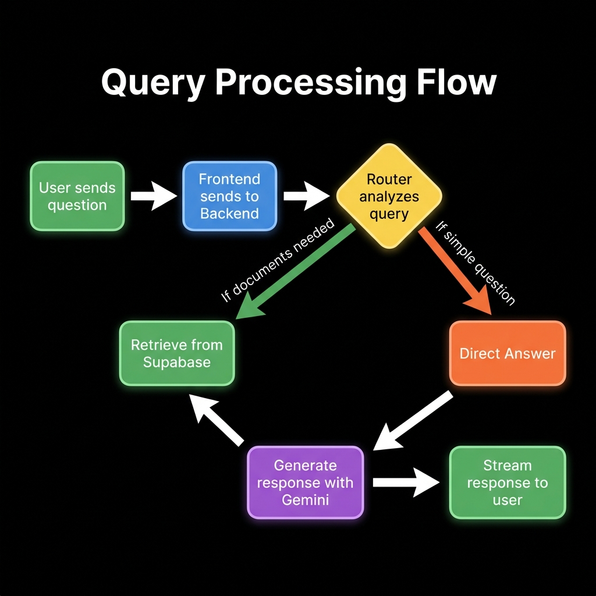

# AI PDF ChatBot

<div align="center">



**Transform your PDFs into intelligent conversations**

[](https://langchain.com)
[](https://ai.google.dev/)
[](https://nextjs.org)
[](https://www.typescriptlang.org/)

</div>

---

## Overview

AI PDF ChatBot is a state-of-the-art Retrieval-Augmented Generation (RAG) application that allows you to have intelligent conversations with your PDF documents. Upload any PDF, and ask questions about its content in natural language. The AI understands context, retrieves relevant information, and provides accurate, source-backed answers.

### Key Features

- **📄 Smart PDF Processing** - Automatically extracts and indexes content from your PDFs
- **💬 Natural Conversations** - Ask questions in plain English and get intelligent responses
- **🎯 Context-Aware** - Uses advanced RAG techniques to provide accurate, relevant answers
- **⚡ Real-time Streaming** - Get responses as they're generated with SSE streaming
- **🎨 Minimalist UI** - Sleek, terminal-inspired black interface with coding fonts
- **🔍 Source Citations** - Every answer includes references to the source documents
- **🚀 Production Ready** - Built with LangGraph for enterprise-grade reliability

---

## 🏗️ Architecture



The application follows a modern, scalable architecture with clear separation of concerns:

- **Frontend (Next.js)**: React-based UI with real-time streaming capabilities
- **Backend (LangGraph)**: Orchestrates AI workflows with two specialized graphs
  - **Ingestion Graph**: Processes and stores PDF content
  - **Retrieval Graph**: Handles queries and generates responses
- **Storage (Supabase)**: Vector database for semantic search
- **AI Model (Google Gemini)**: Powers both embeddings and response generation

---

## 🔄 How It Works

### Document Ingestion Flow



1. **Upload**: User uploads a PDF file
2. **Extract**: Text is extracted from the PDF
3. **Chunk**: Content is split into semantic chunks
4. **Embed**: Google AI generates vector embeddings
5. **Store**: Embeddings are stored in Supabase Vector DB
6. **Ready**: Document is ready for Q&A!

### Query Processing Flow



1. **Question**: User asks a question
2. **Route**: AI router determines if document retrieval is needed
3. **Retrieve**: If needed, relevant chunks are fetched from Supabase
4. **Generate**: Google Gemini generates a contextual response
5. **Stream**: Answer is streamed back to the user in real-time

---

## 🚀 Quick Start

### Prerequisites

- **Node.js** 18+ and **Yarn**
- **Google AI API Key** ([Get it here](https://makersuite.google.com/app/apikey))
- **Supabase Account** ([Sign up here](https://supabase.com))

### Installation

1. **Clone the repository**
   ```bash
   git clone https://github.com/sriramsowmithri9807/AI-PDF-CHATBOT.git
   cd AI-PDF-CHATBOT
   ```

2. **Install dependencies**
   ```bash
   yarn install
   ```

3. **Set up environment variables**

   **Backend** (`backend/.env`):
   ```env
   GOOGLE_API_KEY=your_google_api_key
   SUPABASE_URL=your_supabase_url
   SUPABASE_SERVICE_ROLE_KEY=your_supabase_service_role_key
   LANGCHAIN_TRACING_V2=false
   LANGCHAIN_PROJECT=ai-pdf-chatbot
   ```

   **Frontend** (`frontend/.env.local`):
   ```env
   NEXT_PUBLIC_LANGGRAPH_API_URL=http://localhost:2024
   LANGCHAIN_API_KEY=your_langchain_api_key
   LANGGRAPH_INGESTION_ASSISTANT_ID=ingestion_graph
   LANGGRAPH_RETRIEVAL_ASSISTANT_ID=retrieval_graph
   LANGCHAIN_TRACING_V2=true
   LANGCHAIN_PROJECT=pdf-chatbot
   ```

4. **Set up Supabase**
   
   Run this SQL in your Supabase SQL editor to create the necessary table and function:

   ```sql
   -- Create documents table
   create table documents (
     id bigserial primary key,
     content text,
     metadata jsonb,
     embedding vector(768)
   );

   -- Create index for vector similarity search
   create index on documents using ivfflat (embedding vector_cosine_ops);

   -- Create the match_documents function
   create or replace function match_documents (
     query_embedding vector(768),
     match_count int default 5
   ) returns table (
     id bigint,
     content text,
     metadata jsonb,
     similarity float
   )
   language plpgsql
   as $$
   begin
     return query
     select
       documents.id,
       documents.content,
       documents.metadata,
       1 - (documents.embedding <=> query_embedding) as similarity
     from documents
     order by documents.embedding <=> query_embedding
     limit match_count;
   end;
   $$;
   ```

5. **Run the application**

   **Terminal 1 - Backend**:
   ```bash
   cd backend
   yarn langgraph:dev
   ```

   **Terminal 2 - Frontend**:
   ```bash
   cd frontend
   yarn dev
   ```

6. **Open your browser**
   ```
   http://localhost:3000
   ```

---

## 📖 Usage

### Uploading Documents

1. Click the **paperclip icon** in the chat input
2. Select one or more PDF files (max 10MB each)
3. Wait for the upload and processing to complete
4. Documents are now ready for questions!

### Asking Questions

1. Type your question in the chat input
2. Press **Enter** or click the **send button**
3. Watch as the AI streams its response in real-time
4. Review source citations for transparency

### Example Questions

- *"What is this document about?"*
- *"Summarize the key points in chapter 3"*
- *"What does the author say about [specific topic]?"*
- *"Compare the arguments presented in section 2 and 5"*

---

## 🛠️ Tech Stack

### Frontend
- **Next.js 14** - React framework with App Router
- **TypeScript** - Type-safe development
- **Tailwind CSS** - Utility-first styling
- **Radix UI** - Accessible component primitives
- **LangGraph SDK** - Client for streaming responses

### Backend
- **LangGraph** - Orchestration framework for AI workflows
- **LangChain** - AI application framework
- **Google Generative AI** - Embeddings and chat completions
- **Supabase** - Vector database for semantic search
- **TypeScript** - End-to-end type safety

### Infrastructure
- **Turbo** - Monorepo build system
- **ESLint + Prettier** - Code quality and formatting
- **Jest** - Testing framework

---

## 🎨 Design Philosophy

The UI embraces a **minimalist terminal aesthetic** with:
- **Pure black background** for reduced eye strain
- **JetBrains Mono** coding font for clarity
- **Green/cyan accents** for a tech-forward look
- **Smooth animations** for a premium feel
- **Terminal-style prompts** for a developer-friendly UX

---

## 📁 Project Structure

```
ai-pdf-chatbot-langchain/
├── backend/                 # LangGraph backend
│   ├── src/
│   │   ├── ingestion_graph/ # PDF processing workflow
│   │   ├── retrieval_graph/ # Query answering workflow
│   │   └── shared/          # Shared utilities
│   ├── __tests__/           # Unit and integration tests
│   └── langgraph.json       # LangGraph configuration
│
├── frontend/                # Next.js frontend
│   ├── app/                 # Next.js App Router
│   ├── components/          # React components
│   ├── lib/                 # Utility functions
│   └── constants/           # Configuration constants
│
├── docs/                    # Documentation and assets
│   └── images/              # Diagrams and screenshots
│
└── package.json             # Monorepo configuration
```

---

## 🔧 Configuration

### Model Selection

By default, the app uses **Google Gemini Pro**. You can change this in:

**Backend**: `backend/src/retrieval_graph/configuration.ts`
```typescript
queryModel: configurable.queryModel || 'google-genai/gemini-pro-latest'
```

**Frontend**: `frontend/constants/graphConfigs.ts`
```typescript
queryModel: 'google-genai/gemini-pro-latest'
```

### Retrieval Settings

Adjust the number of document chunks retrieved:

```typescript
k: 5  // Number of chunks to retrieve (default: 5)
```

---

## 🧪 Testing

Run the test suite:

```bash
# Backend tests
cd backend
yarn test

# Frontend tests
cd frontend
yarn test
```

---

## 🚢 Deployment

### Using Docker

```bash
# Build and run with Docker Compose
docker-compose up -d
```

### Using Vercel (Frontend) + Railway (Backend)

1. Deploy frontend to Vercel
2. Deploy backend to Railway or similar platform
3. Update environment variables accordingly

---

## 🤝 Contributing

Contributions are welcome! Please feel free to submit a Pull Request.

1. Fork the repository
2. Create your feature branch (`git checkout -b feature/AmazingFeature`)
3. Commit your changes (`git commit -m 'Add some AmazingFeature'`)
4. Push to the branch (`git push origin feature/AmazingFeature`)
5. Open a Pull Request

---

## 📝 License

This project is licensed under the MIT License - see the [LICENSE](LICENSE) file for details.

---

## 🙏 Acknowledgments

- Built with [LangChain](https://langchain.com) and [LangGraph](https://langchain-ai.github.io/langgraph/)
- Powered by [Google Gemini](https://ai.google.dev/)
- Vector storage by [Supabase](https://supabase.com)
- UI framework by [Next.js](https://nextjs.org)

---

## 📧 Contact

**Sriram Sowmithri** - [sowmithrisriram7@gmail.com](mailto:sowmithrisriram7@gmail.com)

Project Link: [https://github.com/sriramsowmithri9807/AI-PDF-CHATBOT](https://github.com/sriramsowmithri9807/AI-PDF-CHATBOT)

---

<div align="center">

**Made with ❤️ and ☕**

⭐ Star this repo if you find it helpful!

</div>
